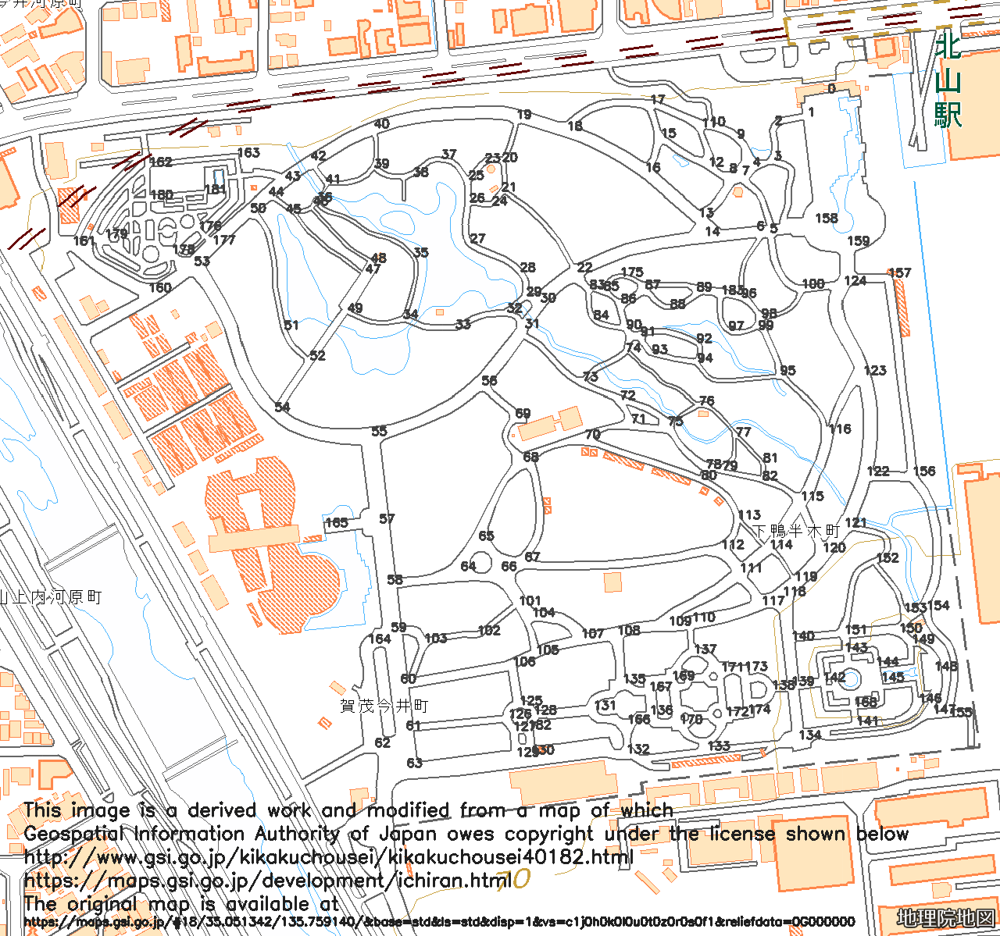
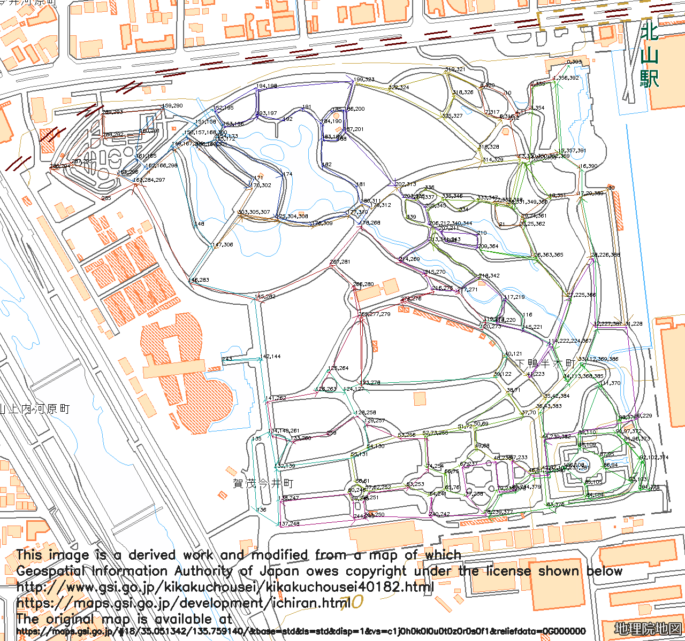

# Another traveling salesman problem

Japanese document is [here](README_jp.md).

## Problem statement

The original traveling salesman problem (TSP) is a problem to find the lowest cost to visit each vertex (city) and return to the start point. We consider a variant of TSP, in which we find the lowest cost to visit each edge (road) and return to the start point.

## Real world example

[Kyoto Botanical Gardens](http://www.pref.kyoto.jp/plant/11900007.html) is a large garden and we can find many plants. We would like to browse each road and view many kinds of plants, though we have limited time for sightseeing in Kyoto. Can we optimize our route in the gardens?

Solving the original TSP results in missing edges and we need another solver.

## Real world map

[Geospatial Information Authority of Japan](https://maps.gsi.go.jp/development/ichiran.html) publishes maps in Japan and we can use, copy, modify and transmit the maps and their derived works under the [license](http://www.gsi.go.jp/kikakuchousei/kikakuchousei40182.html).

Details of Kyoto Botanical Gardens are also available from the [site](https://maps.gsi.go.jp/#18/35.051342/135.759140/&base=std&ls=std&disp=1&vs=c1j0h0k0l0u0t0z0r0s0f1&reliefdata=0G000000). We can clip the map on the website and save its PNG image as 'data/in.png' in our PCs. North and East must be omitted in these latitude and longitude values.

|Parameter|Value|
|:------|:------|
|Top-left latitude|35.051342|
|Top-left longitude|135.759140|
|Bottom-right Latitude|35.046076|
|Bottom-right longitude|135.766007|
|Image width x height|1280 x 1200|

## Prepare vertices and edges data

I created vertices and edges data of the map as [a plain text file](data/tsp_gardens.txt).

* Vertex: X and Y coordinates of a road crossing. The origin (0,0) is top-left of the image.
* Edge: Pair of an index of vertices (non-directed)

```text
# vertex : x and y coordinates <= indicates that vertices are in the following lines
1059 118 <= (X,Y) of vertex 0 (the start point)
1033 148 <= (X,Y) of vertex 1
...

# edge : vertex index pair and optional cost <= indicates that edges are in the following lines
0 1 <= Ties vertex 0 and 1
0 2 <= Ties vertex 0 and 2
...
```

Notice that invalid data may cause errors or exceptions.

## Find a route

Execute the following code in a shell at a directory including README.md.

```bash
python scripts/make_route.py
```

It reads data/in.png (as you downloaded) and data/tsp_gardens.txt (in this repository) and generates the following two image files. This command writes a sequence of vertex indexes (0 means the start and goal) as a route to stdout. Python3 and packages imported from make_route.py are required.

* out_map.png : numbers of vertices are painted over in.png
* out_route.png : a route is painted over in.png

You can change input and output filenames with the following options.

|Option|Attribute|Default|
|:------|:------|:------|
|--input|filename of an input image map|data/in.png|
|--map|Filename of a text file describing vertices and edges|data/tsp_gardens.txt|
|--output|Prefix for output images|out|

```bash
python make_route.py --input in.png --map tsp_gardens.txt --output out
```

## Output images

These images are derived works and modified from a map of which Geospatial Information Authority of Japan owes copyright under the [license](http://www.gsi.go.jp/kikakuchousei/kikakuchousei40182.html).

https://maps.gsi.go.jp/development/ichiran.html

### A map of Kyoto Botanical Gardens with vertices



### A route of Kyoto Botanical Gardens



## License

Copyright (c) 2018 Zettsu Tatsuya

This software is released under the MIT License, see [LICENSE.txt](LICENSE.txt).
